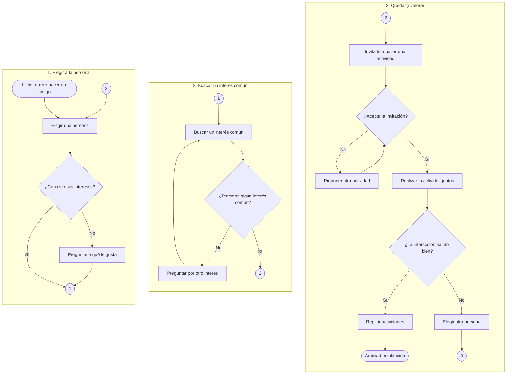

# Diagramas de flujo largos

Un proceso con muchos pasos encadenados sale en una columna estrecha y muy alta,
porque Mermaid coloca una fila por cada nivel del diagrama. El ejemplo de abajo
mide 476 × 1949 píxeles escrito de la forma corriente, y 1489 × 1103 plegado en
cajas, que ya cabe en una pantalla.

## Las cuatro reglas

1. `flowchart LR` por fuera, y cada tramo dentro de un `subgraph` con `direction TB`.
2. Ninguna flecha cruza de una caja a otra: Mermaid ignora la dirección interna
   de un subgrafo en cuanto una flecha lo atraviesa, y entonces todo vuelve a
   alinearse en una tira.
3. La continuidad se marca con conectores numerados, como en los diagramas de
   flujo de papel: un tramo acaba en `([1])` y el siguiente empieza en `([1])`.
4. Enlaces invisibles entre las cajas (`S1 ~~~ S2`) para que se coloquen en fila
   y no apiladas.

Conviene usar `([1])` para los conectores y no `((1))`: el círculo sale enorme y
se come media caja.

## Ejemplo

Todo es sintaxis corriente de Mermaid, así que el archivo sigue valiendo en
cualquier editor y en las versiones que vengan.
